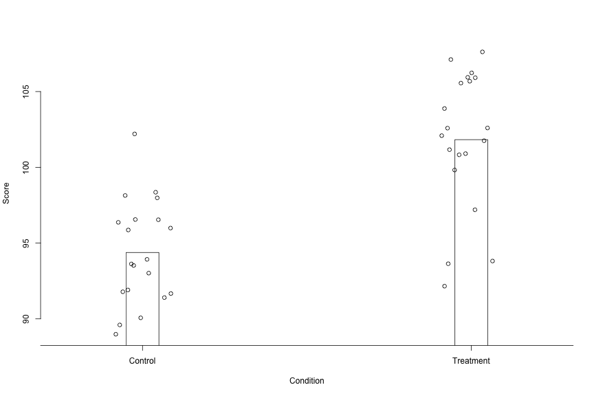
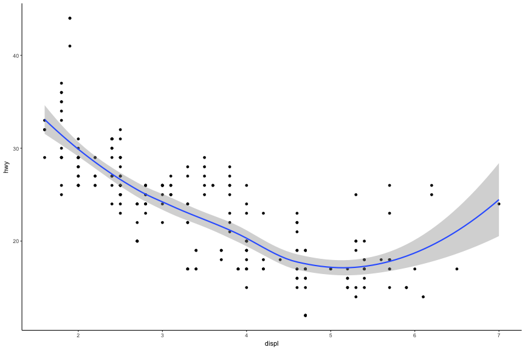
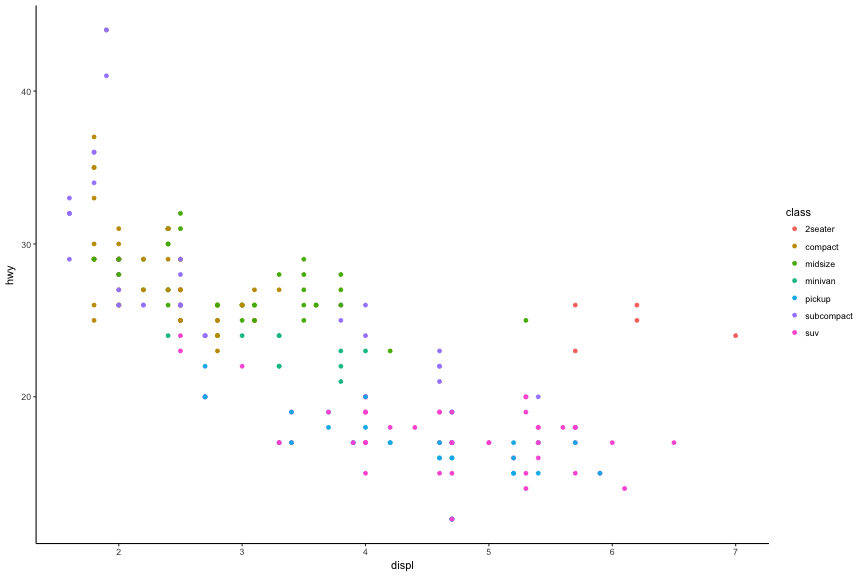
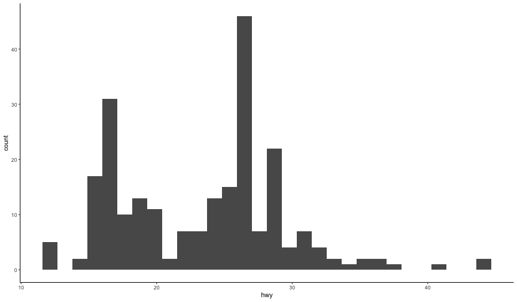
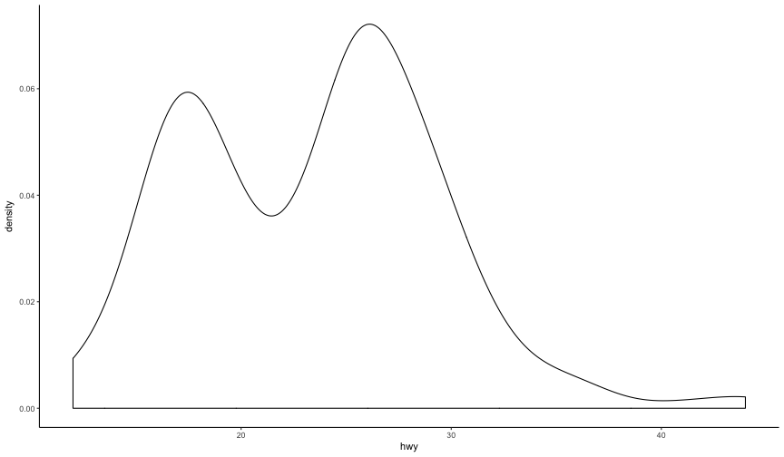
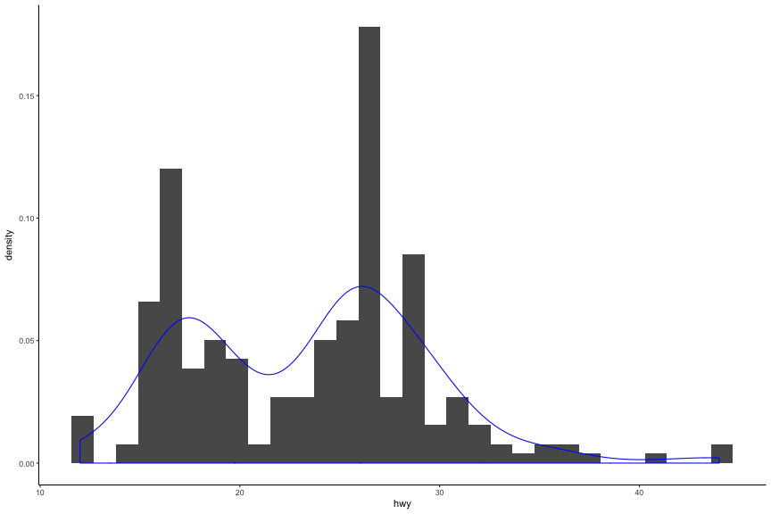
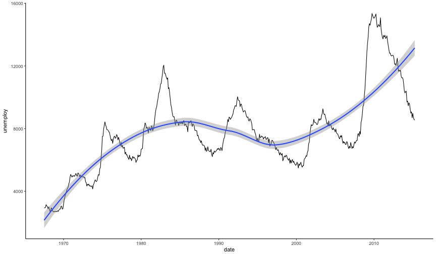

## Combine barplots and jittered stripcharts

----
## Combine boxplots and jittered stripcharts

----
## Best?

----
## Some things to avoid

* 3D plots
* Pie charts
* Dual axes
* Restricted axes
* Unnecessary frills (colors, etc)
	+ Show the data as plainly as possible. Let the data speak!

NOTE: The following 10 slides (and the previous plot) inspired/taken from Karl Broman's presentation on graphs (see [here](https://www.biostat.wisc.edu/~kbroman/presentations/graphs2017.pdf))

--- &twocol
## Examples

*** =left

*** =right

--- &twocol
## Examples

*** =left

*** =right

--- &twocol
## Examples

*** =left

*** =right

--- &twocol
## Examples

*** =left

*** =right

--- &twocol
## Examples

*** =left

*** =right

--- &twocol
## Examples

*** =left

*** =right

--- &twocol
## Examples

*** =left

*** =right

--- &twocol
## Examples

*** =left

*** =right

--- &twocol
## Examples

*** =left

*** =right

--- &twocol
## Examples

*** =left

*** =right

----
## Some great examples: SEDA
Sean Reardon: https://cepa.stanford.edu/seda/overview

----
## Means by district

----
## Average gains by district

----
## Mean scores and SES

----
## Mean scores and SES by Race/Ethniciy

---
## Other examples: Visualizing scale
* Space stuff: http://imgur.com/a/lGabv
 
* Time: http://www.sciencealert.com/watch-this-3-minute-animation-will-change-your-perception-of-time

----
## Some *ggplot* examples

----
## Add an additional aesthetic

----
## Add smooth line for each class
# Too busy

----
## Remove SE

---- .segue
# Some things to avoid

----
## Truncated axes

----

----
## Dual axes

----
## Scaling issues

----
## Poor binning choices

----
## Some general advice
* Consider the purpose of the plot. 
	+ Relation? Scatterplots 
	+ Distribution? Histogram or density plot
	+ Trend? Line plot, scatterplot with smoother, etc.
* How many variables? What type?
	+ One continuous variable: histogram, density plot, or similar
	+ Two continuous: Scatterplot (if you have lots of data, consider binning)
	+ One categorical one continuous: boxplots, violin plots, bar plots
	+ Two categorical variable? Mosaic plot

----
## One continuous variable
# Histogram

----
## One continuous variable
# Density plot

----
## One continuous variable
# Frequency polygon

----
## Consider overlays

----
## Two continuous variables
# Scatterplot

----
## Trend
# Line plot (often with date or time on x-axis)

----
## Trend w/smoother

---
## Categorical & Continuous
# Violin plots

---
## Overlay data

---
## Two categorical variables
# Mosaic plot

----
## Don't end up in a blog for wrong reasons
* https://flowingdata.com/2010/05/14/wait-something-isnt-right-here/
* https://flowingdata.com/2009/11/26/fox-news-makes-the-best-pie-chart-ever/

----
## Conclusions
* Essentially never
	+ Use pie charts (use bar charts instead)
	+ Use dual axes (produce separate plots instead)
	+ Truncate axes
	+ Use 3D unnecessarily
	+ Add color for color's sake (this isn't sales)
* Do
	+ Show the data
	+ Be as clear as possible
	+ Let the data tell the story

----
## Next time
Apply what we've talked about today with R and ggplot!

